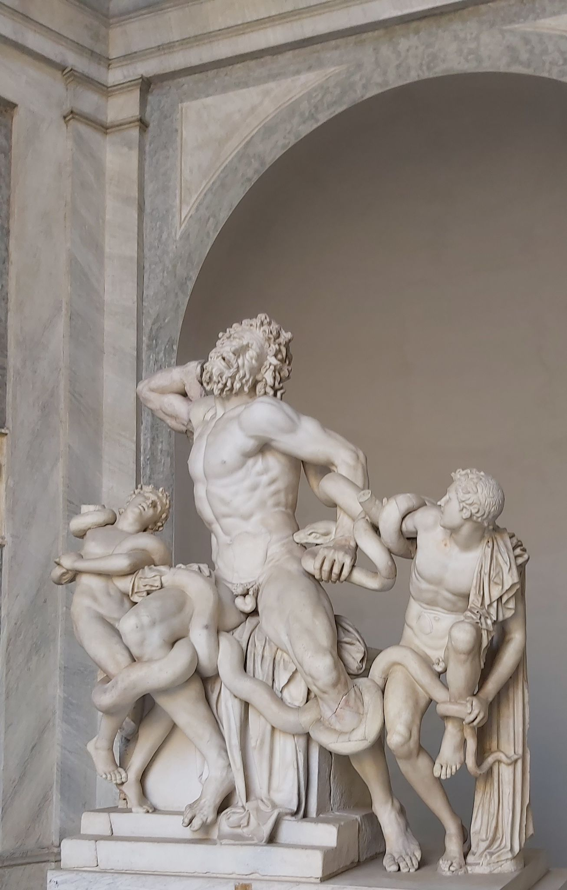
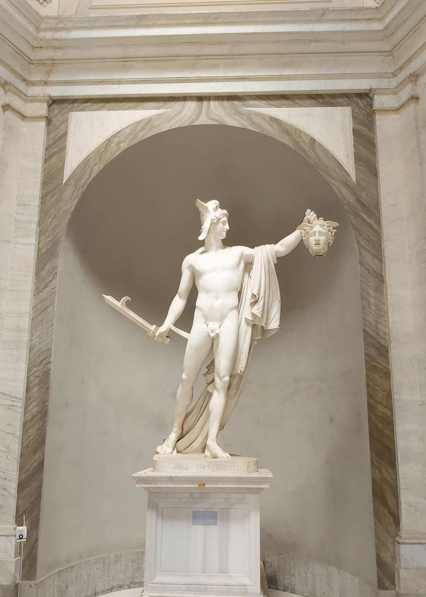
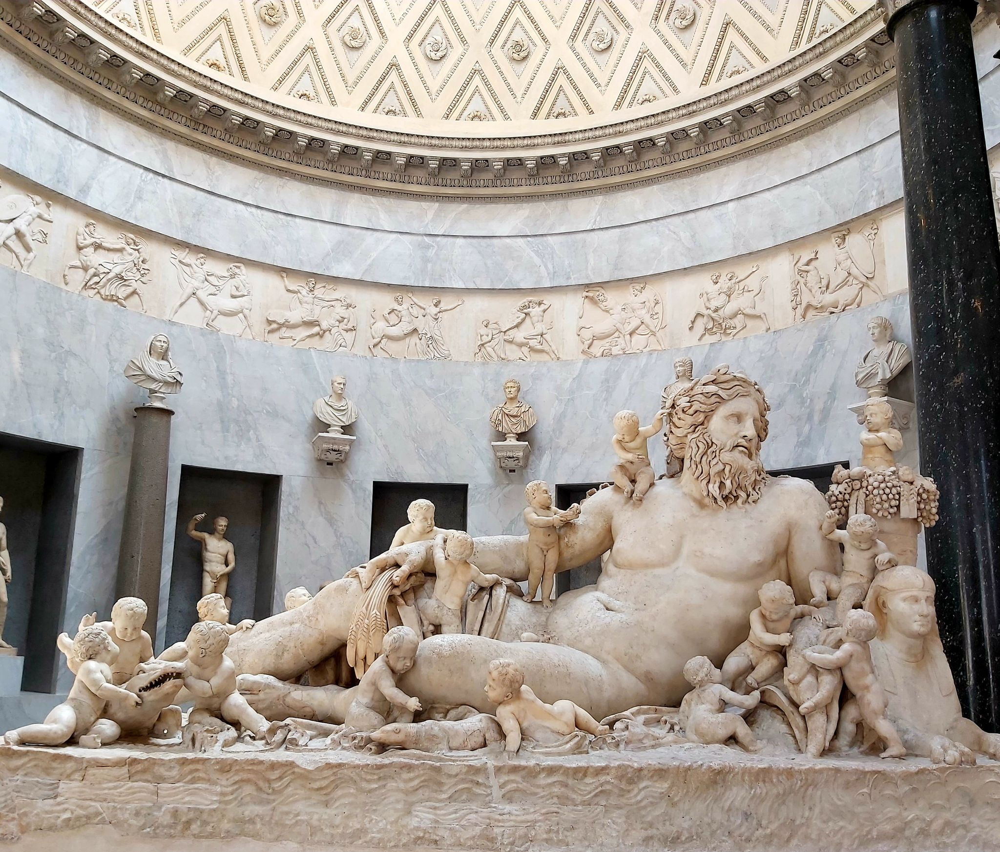
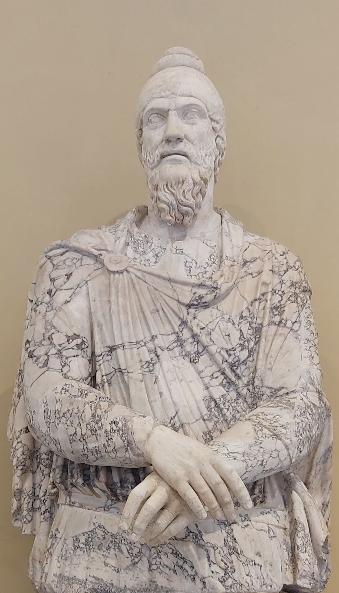
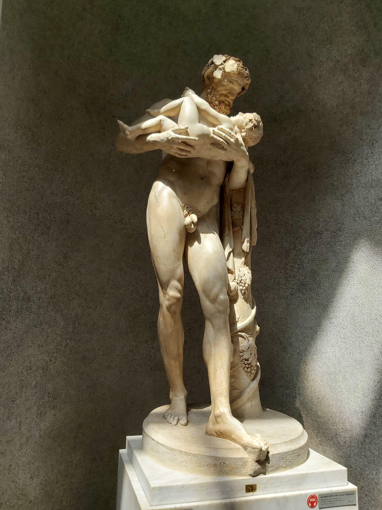
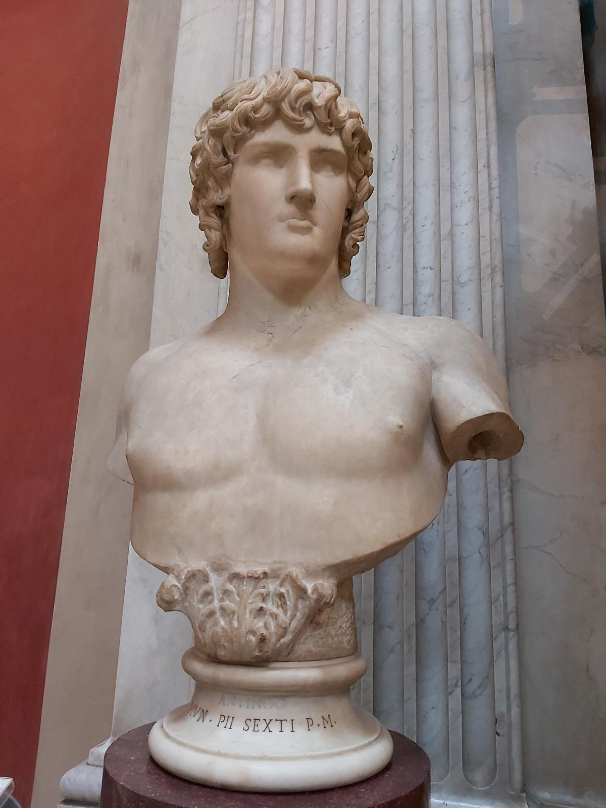
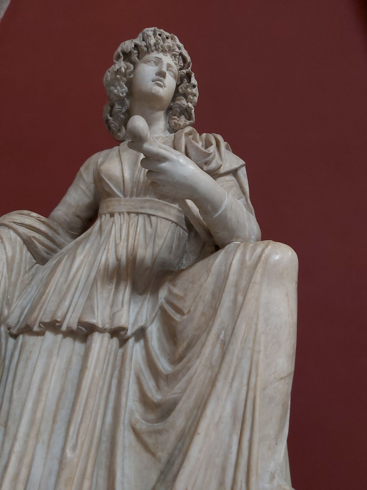

+++
date = '2025-10-17T10:10:50Z'
draft = false
title = 'Vatican Museums'
+++

## The Marble Solitude of the Vatican Gods

In the damp twilight of the Museo Pio-Clementino, one encounters the true heirs of solitude: Greek gods sculpted from a marble so cold it still remembers the heat of the Aegean sun and the hands of a craftsman who died four thousand years ago. Here, the Laocoön writhes in an eternal, mute scream that no soul has heard since the day the serpents were first carved; his agony is not stone, but a persistent echo of an unavenged crime. And the Apollo Belvedere does not stand, he simply is, his posture so perfect that all subsequent notions of masculinity were born lame. These figures—more alive than the cardinals outside—are merely waiting, with the patience of geological epochs, for the day the museum doors will dissolve into dust, so they can finally return to the sea from which they were first dreamed...

